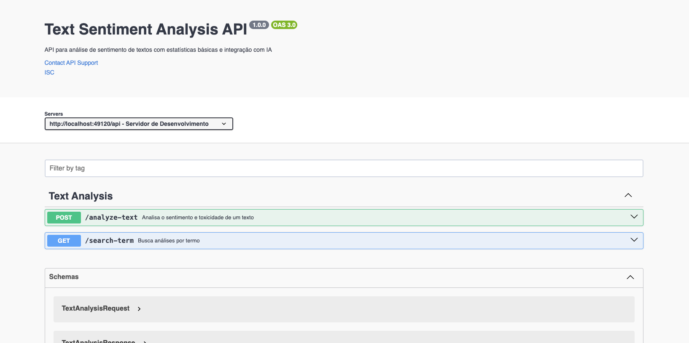

# 🤖 Text Sentiment Analysis API

API que analisa textos usando modelos de IA para detectar sentimento e toxicidade.

<div align="center">
  
</div>

## 📋 Descrição

Esta API uma análise de textos por meio de dois modelos de IA: um para análise de sentimento (positive/negative/neutral) e outro para detecção de toxicidade (toxic, obscene, insult, identity_hate, threat, non-toxic).

## 🛠️ Tecnologias Utilizadas

### **Backend**
- **Node.js** - Runtime
- **TypeScript**
- **Express.js** - Framework
- **TypeORM** - ORM
- **PostgreSQL** - Banco de dados
- **Swagger** - Documentação
- **Docker** - Infraestrutura

### **IA**
- **Hugging Face** - Repositório de modelos de IA
- **distilbert/distilbert-base-uncased-finetuned-sst-2-english** - Modelo para análise de sentimento
- **unitary/toxic-bert** - Modelo para detecção de toxicidade

## 🚀 Como Instalar e Usar

### Pré-requisitos
- Node.js 18+
- Docker e Docker Compose
- Git

### 1. Clone o repositório
```bash
git clone https://github.com/dudunog/text-sentiment-analysis.git
cd text-sentiment-analysis
```

### 2. Instale as dependências
```bash
npm install
```

### 3. Configure as variáveis de ambiente
Crie um arquivo `.env` na raiz do projeto:
```env
# Banco de dados
DATABASE_HOST=localhost
DATABASE_PORT=5438
DATABASE_USER=development
DATABASE_PASSWORD=testing
DATABASE_NAME=text-sentiment-analysis

# Hugging Face (opcional - usa modelos públicos por padrão)
HUGGING_FACE_ACCESS_TOKEN=your_token_here
HUGGING_FACE_BASE_URL=https://router.huggingface.co/hf-inference/models
HUGGING_FACE_SENTIMENT_ANALYSIS_MODEL_URL=distilbert/distilbert-base-uncased-finetuned-sst-2-english
HUGGING_FACE_TOXICITY_MODEL_URL=unitary/toxic-bert
```

### 4. Inicie o banco de dados
```bash
npm run db:dev
```

### 5. Execute as migrações
```bash
npm run migration:run
```

### 6. Inicie o servidor
```bash
# Desenvolvimento
npm run dev
```

### 7. Acesse a documentação
Abra seu navegador e acesse:
```
http://localhost:49120/api-docs
```

## 📚 Endpoints Disponíveis

### POST `/api/analyze-text`
Analisa um texto e retorna sentimento, toxicidade e estatísticas básicas.

**Request:**
```json
{
  "text": "Eu estou muito feliz hoje! O dia está lindo."
}
```

**Response:**
```json
{
  "text": "Eu estou muito feliz hoje! O dia está lindo.",
  "sentiment": "positive",
  "toxicity": "non-toxic",
  "frequent_words": ["muito", "feliz", "hoje", "lindo"],
  "total_words": 8
}
```

### GET `/api/search-term?term=palavra`
Busca análises que contêm um termo específico.

**Response:**
```json
{
  "results": [
    {
      "id": "123e4567-e89b-12d3-a456-426614174000",
      "text": "Texto que contém a palavra buscada",
      "sentiment": "positive",
      "toxicity": "non-toxic",
      "frequent_words": ["palavras", "frequentes"],
      "total_words": 5
    }
  ],
  "total_found": 1,
  "search_term": "palavra"
}
```

## 🎯 Extra Mile: Análise de Toxicidade

Além da análise de sentimento, implementei **análise de toxicidade** usando o modelo `unitary/toxic-bert` do Hugging Face. Esta funcionalidade classifica o texto em:

- **Toxic** - Conteúdo tóxico
- **Obscene** - Linguagem obscena
- **Insult** - Insultos e ofensas
- **Identity Hate** - Discurso de ódio
- **Threat** - Ameaças
- **Non-toxic** - Conteúdo não-tóxico

### 🔍 Como Funciona

1. **Análise Dupla**: O texto é processado por dois modelos simultaneamente
2. **Como é feita a classificação?**: A API identifica a categoria com maior score
3. **Threshold Adaptativo**: Scores baixos (< 0.1) são classificados como "non-toxic"
4. **Resposta**: Retorna apenas a classificação principal do texto

## 🏗️ Arquitetura

```
src/
├── contexts/
│   └── text-analysis/
│       ├── controllers/          # Controladores
│       ├── domain/              # Modelos de domínio
│       ├── external/            # Adaptadores externos
│       └── usecases/           # Casos de uso
├── main/
│   ├── adapters/               # Adaptadores
│   ├── config/                 # Configurações
│   │   ├── database/           # Configuração do banco
│   │   └── environment/        # Variáveis de ambiente
│   ├── constants/              # Constantes
│   ├── middlewares/            # Middlewares
│   └── server/                 # Servidor
└── shared/
    ├── errors/                 # Tratamento de erros
    ├── helpers/                # Helpers
    ├── protocols/              # Interfaces e tipos
    │   └── logger/             # Logger
    ├── providers/              # Provedores externos
    │   └── hugging-face/       # Provedor Hugging Face
    ├── utils/                  # Utilitários
    └── validations/            # Validações
```

## 🤝 Contribuição

1. Fork o projeto
2. Crie uma branch para sua feature (`git checkout -b feature/AmazingFeature`)
3. Commit suas mudanças (`git commit -m 'Add some AmazingFeature'`)
4. Push para a branch (`git push origin feature/AmazingFeature`)
5. Abra um Pull Request

## 📄 Licença


<a href="https://opensource.org/licenses/MIT">
  
</a>

<br>
<br>

>  This is a challenge by [Coodesh](https://coodesh.com/)
